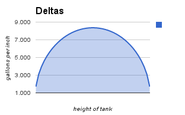

Heroku Fueltank
===============

Heroku app to try [Mojolicious](http://mojolicio.us/) that takes fuel tank levels
and guesses how long you will still have heat.

Tank Calculations
-----------------

It is easy to figure out the filled volume of a cylinder on its end, but it is
not easy to do with a cylinder on its side as is typical with most fuel tanks:

Our fuel tank is 42" in diameter and 46" long, so after a bit of googling and
playing with a spreadsheet I had a conversion chart for inches of depth from the
bottom into gallons of fuel that should represent:

| Height in Inches `column E` | Gallons `column F` | Gallons Formula `column F` |
| ---------------: | ------: | :------ |
|	1	|	1.7	| `=(B$3*(((B$8^2)*acos((B$8-E2)/B$8)-sqrt(2*B$8*E2-E2^2)*(B$8-E2)))/231)` |
|	2	|	4.8	| `=(B$3*(((B$8^2)*acos((B$8-E3)/B$8)-sqrt(2*B$8*E3-E3^2)*(B$8-E3)))/231)` |
|	3	|	8.7	| `=(B$3*(((B$8^2)*acos((B$8-E4)/B$8)-sqrt(2*B$8*E4-E4^2)*(B$8-E4)))/231)` |
|	4	|	13.4	| `=(B$3*(((B$8^2)*acos((B$8-E5)/B$8)-sqrt(2*B$8*E5-E5^2)*(B$8-E5)))/231)` |
|	5	|	18.5	| `=(B$3*(((B$8^2)*acos((B$8-E6)/B$8)-sqrt(2*B$8*E6-E6^2)*(B$8-E6)))/231)` |
|	6	|	24.2	| `=(B$3*(((B$8^2)*acos((B$8-E7)/B$8)-sqrt(2*B$8*E7-E7^2)*(B$8-E7)))/231)` |
|	7	|	30.2	| `=(B$3*(((B$8^2)*acos((B$8-E8)/B$8)-sqrt(2*B$8*E8-E8^2)*(B$8-E8)))/231)` |
|	8	|	36.6	| `=(B$3*(((B$8^2)*acos((B$8-E9)/B$8)-sqrt(2*B$8*E9-E9^2)*(B$8-E9)))/231)` |
|	9	|	43.3	| `=(B$3*(((B$8^2)*acos((B$8-E10)/B$8)-sqrt(2*B$8*E10-E10^2)*(B$8-E10)))/231)` |
|	10	|	50.3	| `=(B$3*(((B$8^2)*acos((B$8-E11)/B$8)-sqrt(2*B$8*E11-E11^2)*(B$8-E11)))/231)` |
|	11	|	57.6	| `=(B$3*(((B$8^2)*acos((B$8-E12)/B$8)-sqrt(2*B$8*E12-E12^2)*(B$8-E12)))/231)` |
|	12	|	65.0	| `=(B$3*(((B$8^2)*acos((B$8-E13)/B$8)-sqrt(2*B$8*E13-E13^2)*(B$8-E13)))/231)` |
|	13	|	72.7	| `=(B$3*(((B$8^2)*acos((B$8-E14)/B$8)-sqrt(2*B$8*E14-E14^2)*(B$8-E14)))/231)` |
|	14	|	80.5	| `=(B$3*(((B$8^2)*acos((B$8-E15)/B$8)-sqrt(2*B$8*E15-E15^2)*(B$8-E15)))/231)` |
|	15	|	88.5	| `=(B$3*(((B$8^2)*acos((B$8-E16)/B$8)-sqrt(2*B$8*E16-E16^2)*(B$8-E16)))/231)` |
|	16	|	96.5	| `=(B$3*(((B$8^2)*acos((B$8-E17)/B$8)-sqrt(2*B$8*E17-E17^2)*(B$8-E17)))/231)` |
|	17	|	104.7	| `=(B$3*(((B$8^2)*acos((B$8-E18)/B$8)-sqrt(2*B$8*E18-E18^2)*(B$8-E18)))/231)` |
|	18	|	112.9	| `=(B$3*(((B$8^2)*acos((B$8-E19)/B$8)-sqrt(2*B$8*E19-E19^2)*(B$8-E19)))/231)` |
|	19	|	121.2	| `=(B$3*(((B$8^2)*acos((B$8-E20)/B$8)-sqrt(2*B$8*E20-E20^2)*(B$8-E20)))/231)` |
|	20	|	129.6	| `=(B$3*(((B$8^2)*acos((B$8-E21)/B$8)-sqrt(2*B$8*E21-E21^2)*(B$8-E21)))/231)` |
|	21	|	137.9	| `=(B$3*(((B$8^2)*acos((B$8-E22)/B$8)-sqrt(2*B$8*E22-E22^2)*(B$8-E22)))/231)` |
|	22	|	146.3	| `=B$6-F21` |
|	23	|	154.6	| `=B$6-F20` |
|	24	|	162.9	| `=B$6-F19` |
|	25	|	171.2	| `=B$6-F18` |
|	26	|	179.4	| `=B$6-F17` |
|	27	|	187.4	| `=B$6-F16` |
|	28	|	195.4	| `=B$6-F15` |
|	29	|	203.2	| `=B$6-F14` |
|	30	|	210.8	| `=B$6-F13` |
|	31	|	218.3	| `=B$6-F12` |
|	32	|	225.5	| `=B$6-F11` |
|	33	|	232.5	| `=B$6-F10` |
|	34	|	239.3	| `=B$6-F9` |
|	35	|	245.7	| `=B$6-F8` |
|	36	|	251.7	| `=B$6-F7` |
|	37	|	257.4	| `=B$6-F6` |
|	38	|	262.5	| `=B$6-F5` |
|	39	|	267.1	| `=B$6-F4` |
|	40	|	271.1	| `=B$6-F3` |
|	41	|	274.2	| `=B$6-F2` |
|	42	|	275.9	| `=B$6` |

Those formulas refer to a few other values: `B2` is the diameter and `B8` is the
radius of the tank.  `B3` is the width of the tank.
`B6` is the volume of the entire tank.

One of the things that helped make me confidant that the results were valid
was graphing the difference in gallons between each inch of tank:

It makes a reassuring curve like the side of our tank.

Thanks
------

* [Doctor Byron](http://mathforum.org/library/drmath/view/56455.html) was the only place I could find
that was informative enough for me to figure out the inches to gallons conversion in a spreadsheet.
I know I could have done this with Calculus, but since I haven't needed that for 20 years why break
my record?

TODOs
-----

* fix `favicon.ico`
* estimate how long fuel will last
* track entries in database
* graph entries from database
